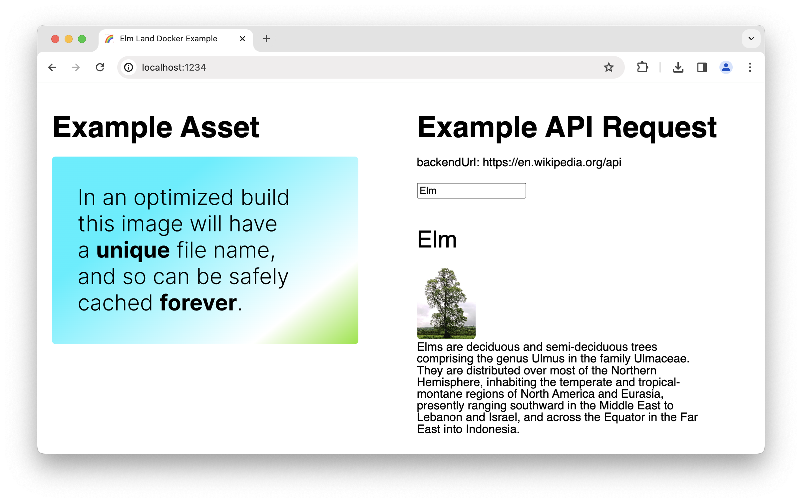

# Elm Land Docker Example

# 

## Features

- Assets caching (set up in container too)
- Docker build (can be deployed in private environment)
- Application is configured at runtime via environment variables:
  - Application config
  - Whether or not to allow indexing (`robots.txt`)
- Deployment can be done without accessing the source code (Docker image doesn't contain any sources, and customer can parametrize the app via environment variables and deploy wherever they want)

## Prerequisites

- NPM
- Docker

## Local development (without Docker)

- Install dependencies and start dev server

  ```sh
  npm i
  npm start
  ```

- Open http://localhost:1234

## Docker

- Build and run Docker container

  ```sh
  docker build -t elm-land-docker-example . &&
    docker container run \
      -p 1234:80 \
      -e WEBAPP_ALLOW_INDEXING="true" \
      -e WEBAPP_BACKEND_URL="https://en.wikipedia.org/api" \
      elm-land-docker-example
  ```

- Open http://localhost:1234

## How to add new env variables:

- `public/nocache/config.json` (and set default value for local development)
- `configs/nginx.on-startup.sh` (see the end of file)
- `src/Shared/Config.elm` (decode and use new values in your Elm app)
